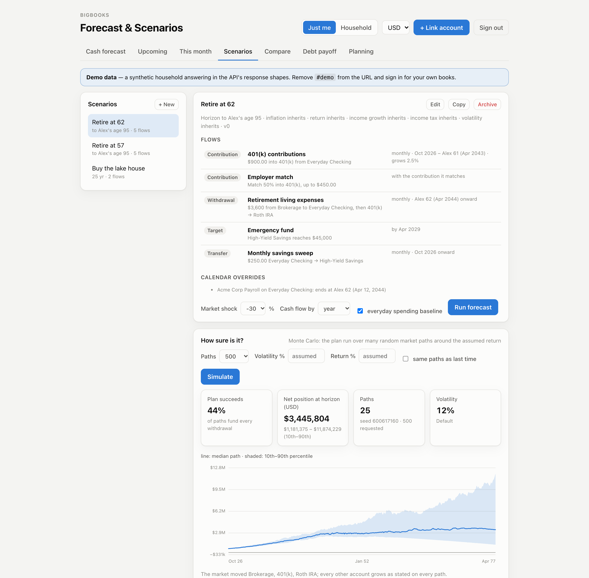
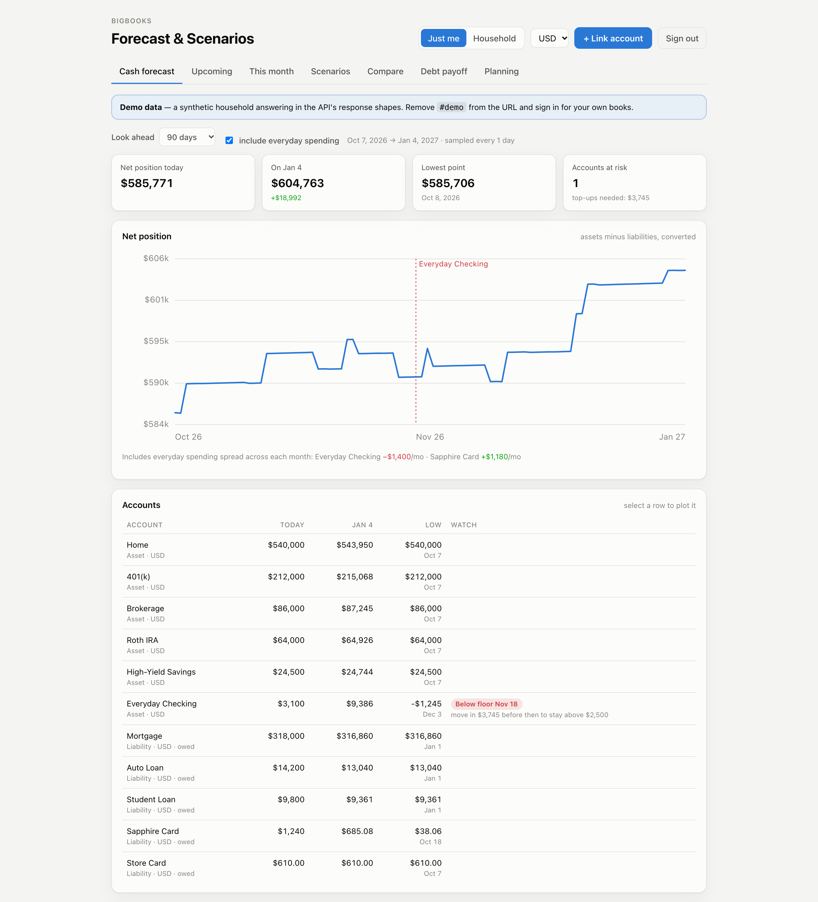
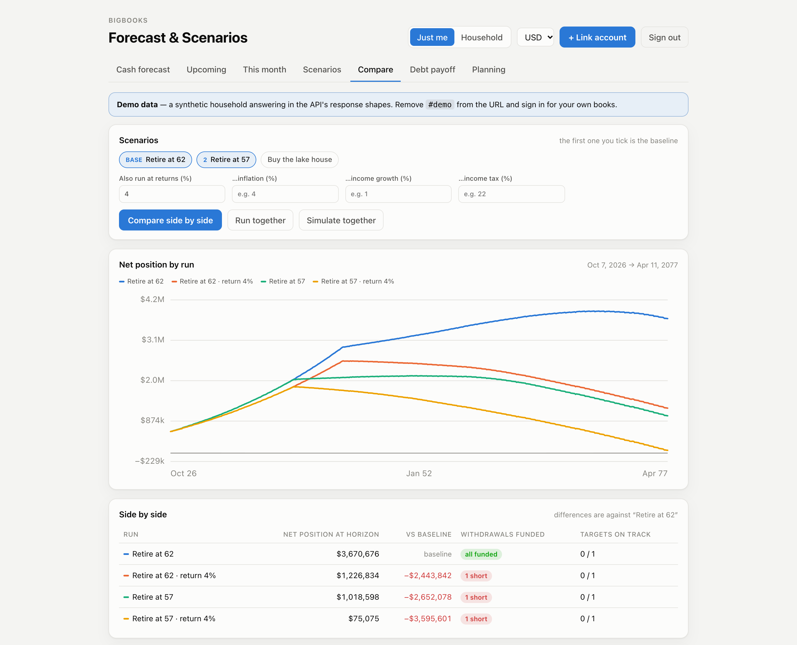
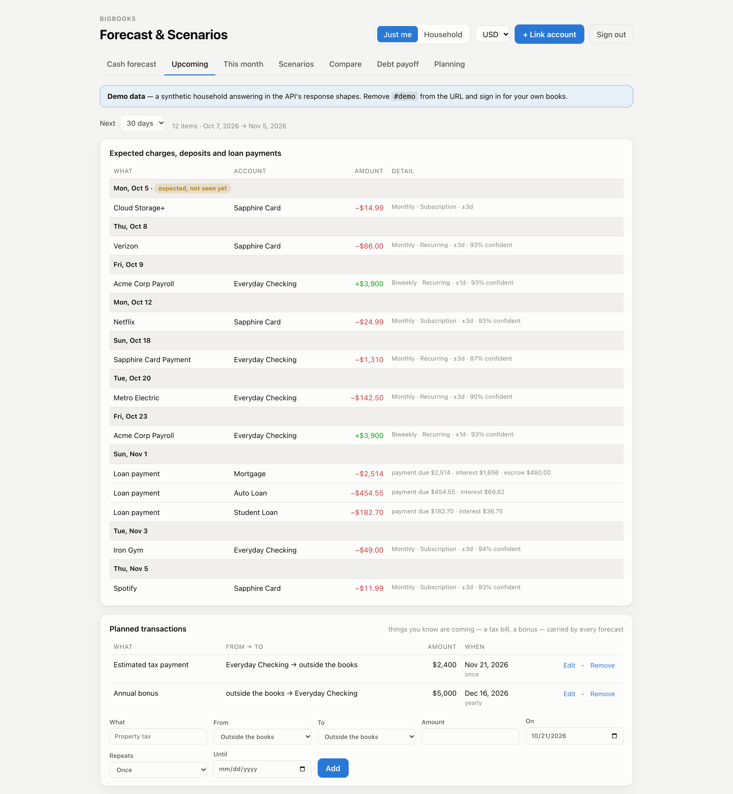

# BigBooks Forecast & Scenarios

A planning app for the [BigBooks](https://www.bigbooks.app) forward-looking API: where your cash
is heading over the next few months, and whether a long-range plan, such as retiring at 62 or
buying a lake house, holds up. **Fully static**: no backend, no build step, no dependencies, just
HTML, CSS and ES modules. Authentication is **OAuth 2.0 Authorization Code + PKCE** entirely in
the browser, so there is no client secret to protect and nothing runs server-side.



<sup>Screenshots from `#demo` mode: a synthetic household, no account needed. The demo computes at most 25 simulation paths.</sup>

It shows:

- **A cash forecast** day by day: each account's low point, the first day it breaks its floor,
  and the top-up that would prevent it. A **what-if** adds one-off flows for a single run and
  saves nothing.
- **Scenarios**: contributions, withdrawals with fallback accounts, employer matches, targets,
  RMDs, calendar overrides ("the paycheck stops at 62") and hypothetical accounts (the house not
  yet bought, and its mortgage). A run says whether each withdrawal is funded, and if not, the
  extra monthly saving or the later start that would fix it. It also shows the same under a
  market shock.
- **"How sure is it?"**: a Monte Carlo simulation over many market paths, giving the odds the plan
  succeeds and each target is met, repeatable by seed.
- **Comparisons** of scenarios side by side under other return, inflation, income-growth or
  tax rates, each measured against the first.
- **What's coming**: expected charges and loan payments, **planned transactions** you know about,
  **declared recurring charges** the calendar can't detect yet, and a subscription audit.
- **This month**: where each budget category ends the month.
- **Debt payoff**: minimums vs. avalanche vs. snowball.
- **Plaid account linking**, because every view projects your own books, and there is nothing to
  project until something is linked.



Comparing runs puts each scenario and each alternative rate on one chart, with the difference
from the first:





## Bring your own Plaid credentials

**BigBooks does not ship Plaid credentials and will not spend anyone else's.** Linking an account
calls Plaid with **a client id and secret you stored yourself**, and the Plaid usage is billed to
your Plaid account. Add them at **<https://www.bigbooks.app/data-secrets>** (sign-in required); you
get both from the [Plaid dashboard](https://dashboard.plaid.com/developers/keys). Without them the
first call of the link flow fails with `500 internal_error` and the message *"Plaid secret could
not be resolved"*.

- Credentials are stored **per party**, and the party that matters is the one that **owns the
  OAuth client** this app signs in with: the account you were signed in as at
  <https://www.bigbooks.app/clients> when you created the client.
- **There is nowhere in this repository to put a Plaid secret**, and that is deliberate: anything
  in `config.js` ships to every browser that loads the page. The API accepts `X-Plaid-Client-ID`
  and `X-Plaid-Secret` headers as a fallback for server-side callers; a browser app must never
  send them.
- Your Plaid environment matters too: sandbox credentials only open sandbox institutions (use
  Plaid's test logins), and production credentials need Plaid to have approved your account.

## How it works

```
Browser (this static app)
  │  1. Authorization Code + PKCE  ──►  {issuer}/oauth2/authorize + /oauth2/token
  │       (the issuer is discoverable: a 401 from the API points at
  │        /api/.well-known/oauth-protected-resource → authorization_servers)
  │  2. id_token `bigbooks:party` claim, or GET {issuer}/oauth2/userInfo  ──►  your party id
  │  3. GET /v1/forecast, /v1/upcoming, /v1/scenarios/…  ──►  every view (X-Acting-Party-ID)
  │  4. PUT/DELETE with If-Match: "<version>"  ──►  scenarios, people, planned transactions
  └► POST /v1/plaid/public/token → Plaid Link → POST /v1/plaid/access/token
```

Linking follows the spec's request bodies: `PlaidPublicTokenBody` (`clientName`, `language`,
`countryCodes`, `clientUserId`), then `PlaidAccessTokenBody` (`publicToken`, `party`,
`linkSessionId`, `webhook`, `institution`). The exchange's `webhook` is the API's own
`…/v1/plaid/webhook`, matching what BigBooks registers when it mints the link token. The access
token lives only in `sessionStorage` for the current tab.

## What's in it

| Tab | What it shows | Endpoints |
| --- | --- | --- |
| **Cash forecast** | Net position day by day, each account's low point, floor breaches and the top-up that prevents them, with or without everyday spending. **What if…** adds one-off flows for a single run and saves nothing. | `GET /v1/forecast`, `POST /v1/forecast` |
| **Upcoming** | Expected charges, deposits and loan payments; **planned transactions** you know are coming (a tax bill, a bonus); **declared recurring charges** the calendar can't detect yet; and the subscription audit | `GET /v1/upcoming`, `GET/POST/PUT/DELETE /v1/planning/transactions`, `GET /v1/recurrences`, `GET/POST/DELETE /v1/recurrences/declarations`, `GET /v1/recurrences/audit` |
| **This month** | Where each budget category ends the month: posted so far, known streams still to come, the everyday run-rate, against the budget | `GET /v1/budgeting/projection` |
| **Scenarios** | List, create, edit, copy and archive scenarios. Each one covers flows, calendar overrides, hypothetical accounts and exclusions. A run reports funding (short or funded, the extra saving needed, or how much later withdrawals can start), a market-shock stress test, targets, household cash flow, and a per-account ledger trace. **How sure is it?** runs a Monte Carlo simulation: the odds each withdrawal is funded and each target met, and a 10th–90th percentile fan of net position, repeatable by seed. Scenarios carry an income-tax rate on IRA/401(k) withdrawals, a volatility, RMD flows and dated calendar overrides. | `GET/POST /v1/scenarios`, `GET/PUT/DELETE /v1/scenarios/{id}`, `POST …/{id}/copy`, `GET …/{id}/forecast`, `GET …/{id}/forecast/ledger`, `GET …/{id}/forecast/simulation` |
| **Compare** | Scenarios side by side under alternative return, inflation or income-growth rates, with differences from the first. Rates can include income tax. **Run together** and **Simulate together** combine several scenarios into one plan. | `GET /v1/scenarios/compare`, `GET /v1/scenarios/forecast`, `GET /v1/scenarios/simulation` |
| **Debt payoff** | Minimums vs. avalanche vs. snowball for an extra monthly amount, with debts left out for missing terms | `GET /v1/debts/payoff` |
| **Link account** | Plaid Link, and a first-run prompt when nothing is linked yet | `POST /v1/plaid/public/token`, `POST /v1/plaid/access/token`, `GET /v1/plaid/items` |
| **Planning** | Default rates (including income tax and market volatility), and the people scenarios can be dated by (for example, "retire at 62") | `GET/PUT /v1/planning/assumptions`, `GET/POST /v1/planning/persons`, `PUT/DELETE /v1/planning/persons/{id}` |

The **Just me / Household** toggle sends `perspective=SINGLETON|COMPOSITE`. The currency picker sends `unit_type`.

## Run it

```bash
python3 -m http.server 5174 --directory public
```

- `http://localhost:5174/#demo` uses a synthetic household. An in-page simulation answers
  every route in the spec's response shapes, so no account is needed. Its simulations compute at most 25 paths.
- For live data, register a **public OAuth client** (PKCE) at `{issuer}/clients` with
  `http://localhost:5174/` as its redirect URI and the `openid profile email` scopes, and set
  `CLIENT_ID` in [`public/config.js`](public/config.js). `API` and `ISSUER` point at BigBooks
  staging. The issuer's CORS allow-list is built from registered redirect URIs, so registering
  the redirect URI is the whole setup, and it takes about a minute to apply.
- Store your Plaid credentials (above) before linking an account.
- With `ALLOW_PASTED_TOKEN` on in `config.js`, the sign-in card also accepts a pasted access
  token and party id for local development.

## Layout

```
public/
  index.html     markup for the seven tabs
  styles.css     light/dark tokens, layout
  config.js      client id, API and issuer
  api.js         PKCE, token/session, fetch with If-Match / ETag and error bodies
  endpoints.js   one wrapper per operation in the spec
  charts.js      SVG line and percentile-band charts with crosshair tooltip
  app.js         the views, Plaid Link
  demo.js        demo backend (#demo only)
docs/            the README screenshots
openapi.json     the BigBooks API spec the app was built from, for reference
.claude/
  launch.json    serves public/ on :5174 for Claude Code previews
```

## See also

[networth-dashboard-sample](https://github.com/BigBooksApp/networth-dashboard-sample) and
[envelope-budgeting-sample](https://github.com/BigBooksApp/envelope-budgeting-sample): the same
static-app pattern over balance sheets and budgeting.

## Questions

Ask in the [BigBooks Developers Discord](https://discord.gg/DTwq2Ukuty).
